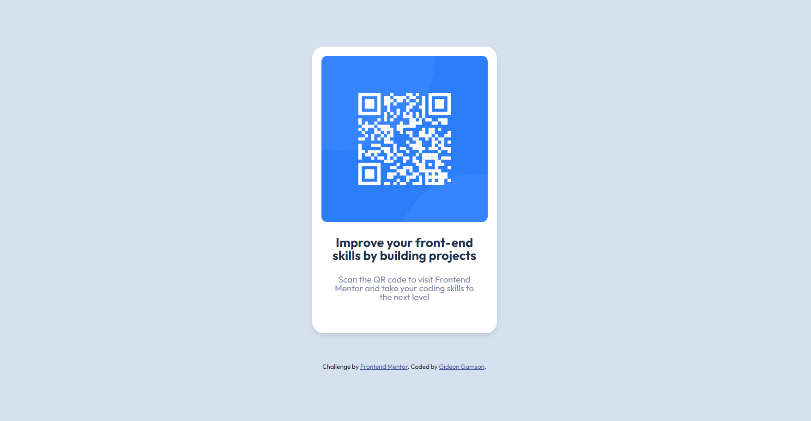

# Frontend Mentor - QR code component solution

This is a solution to the [QR code component challenge on Frontend Mentor](https://www.frontendmentor.io/challenges/qr-code-component-iux_sIO_H). Frontend Mentor challenges help you improve your coding skills by building realistic projects.

# Table of contents

- [Frontend Mentor - QR code component solution](#frontend-mentor---qr-code-component-solution)
- [Table of contents](#table-of-contents)
  - [Overview](#overview)
    - [Screenshot](#screenshot)
    - [Links](#links)
  - [My process](#my-process)
    - [Built with](#built-with)
    - [Useful resources](#useful-resources)
  - [Author](#author)

## Overview

### Screenshot

### Links

- Solution URL: [ Link to QR Code component solution](https://github.com/Gamson3/Responsive-QR-Code-Card-Front-End-Mentor-Challenge)
- Live Site URL: [ Live QR Code component display](https://gamson3.github.io/Responsive-QR-Code-Card-Front-End-Mentor-Challenge/)

## My process

### Built with

- Semantic HTML5 markup
- CSS custom properties
- Flexbox
- Mobile-first workflow

### Useful resources

- [MDN Web Docs - Flexbox](https://developer.mozilla.org/en-US/docs/Web/CSS/CSS_Flexible_Box_Layout) - A comprehensive guide from MDN Web Docs 
- [Google Fonts](https://fonts.google.com/) - Google Fonts provides a wide selection of fonts that you can easily integrate into your project.

## Author

- Frontend Mentor - [@Gamson3](https://www.frontendmentor.io/profile/Gamson3)
